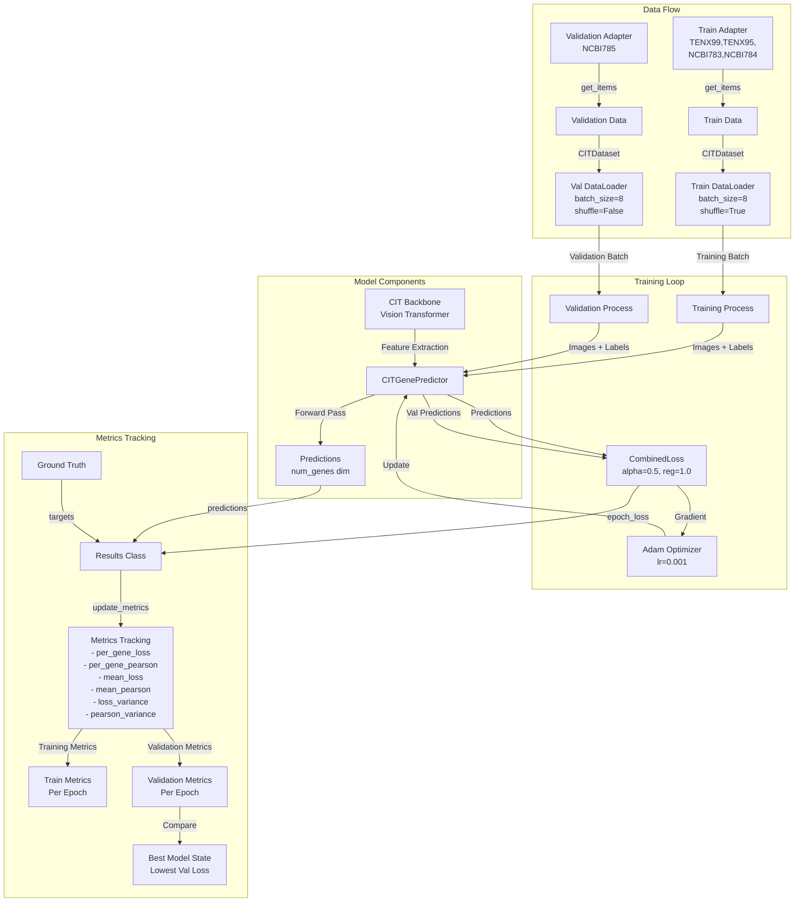
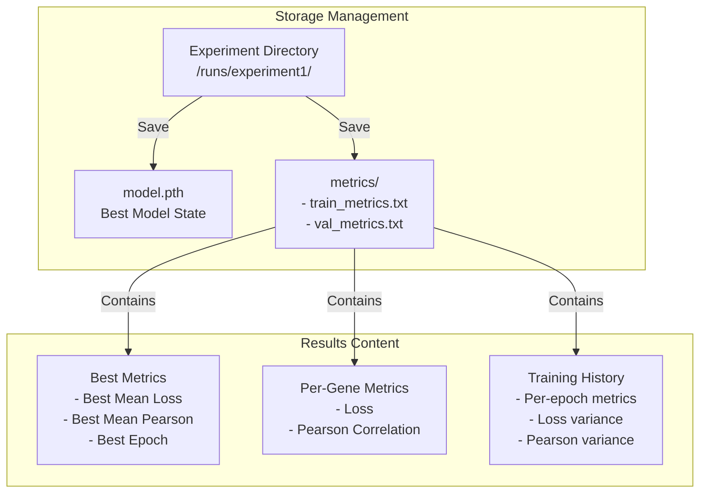

# Data Flow Diagram for SpatX Training Pipeline

## 1. Data Sources
```mermaid
flowchart TD
    subgraph External Data Sources
        ImgDir[20x Image Directory<br>*.png files] --> |Raw Images| BA
        CSV[breast.csv<br>Gene Expression Data] --> |Expression Values| BA
        WSI_IDs[WSI IDs Lists<br>Train/Val Split] --> |Data Split Config| BA
    end

    subgraph Data Adapters
        BA[BreastDataAdapter]
        BA --> |get_items()| Data1[Data Class<br>train_data]
        BA --> |get_items()| Data2[Data Class<br>validation_data]
    end

    subgraph Dataset Processing
        Data1 --> |__getitem__| DS1[CITDataset<br>train_dataset]
        Data2 --> |__getitem__| DS2[CITDataset<br>validation_dataset]
        DS1 --> |DataLoader| DL1[train_dataloader<br>batch_size=8<br>shuffle=True]
        DS2 --> |DataLoader| DL2[validation_dataloader<br>batch_size=8<br>shuffle=False]
    end
```

## 2. Model Architecture & Training


## 3. Output & Storage


## Key Data Flow Steps:

1. **Data Ingestion**:
   - Images (*.png) → BreastDataAdapter
   - Gene expressions (CSV) → BreastDataAdapter
   - WSI IDs for train/val split → Separate adapters

2. **Data Processing**:
   - BreastDataAdapter → Data class → CITDataset → DataLoader
   - Outputs batches of (images, expressions, metadata)

3. **Model Flow**:
   - Images → CIT Backbone → Feature extraction
   - Features → CITGenePredictor → Gene expression predictions
   - Predictions + Ground truth → CombinedLoss → Loss value

4. **Training Process**:
   - Loss → Backward pass → Gradient computation
   - Optimizer → Model parameter updates
   - Validation → Best model state saving

5. **Metrics Collection**:
   - Predictions + Ground truth → Results class
   - Per-gene metrics computation
   - Best metrics tracking
   - Metrics file writing

6. **Output Storage**:
   - Model state → model.pth
   - Training metrics → metrics/*.txt
   - All saved in experiment-specific directory

## Key Variables:
- `train_adp`, `validation_adp`: BreastDataAdapter instances
- `train_data`, `validation_data`: Data class instances
- `train_dataset`, `validation_dataset`: CITDataset instances
- `model`: CITGenePredictor instance
- `optimizer`: Adam optimizer
- `criterion`: CombinedLoss instance
- `results`: Results tracking instance
- `best_model_state`: Best performing model state
- `best_val_loss`: Best validation loss achieved
